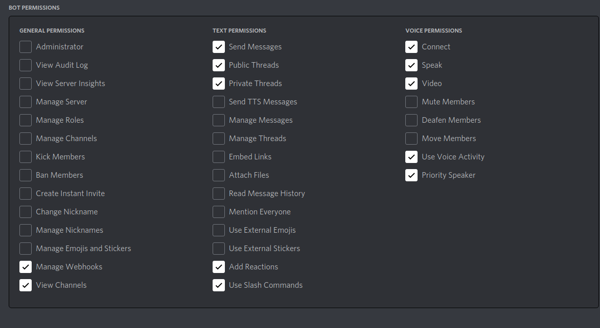
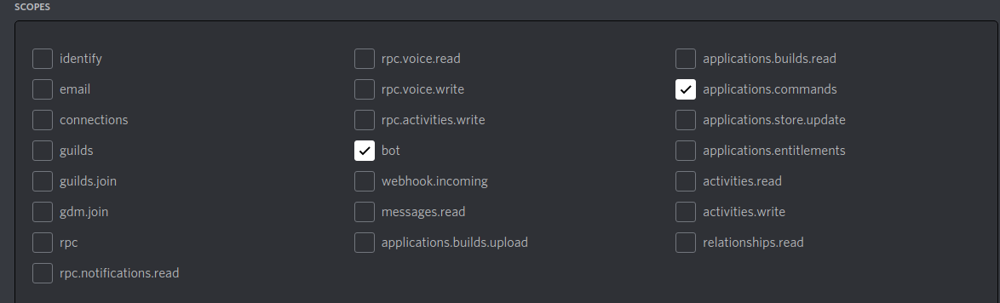

## qqbot
A Discord bot for music.

## commands

<ul>
<li>/wakeup: Wakes up the bot which adds itself to your current voice channel
</li>
<li>/sleep: Opposite of wakeup</li>
<li>/play <song_title>: Searches the song on youtube, then streams it to the voice channel it is added to</li>
<li>/pause: Pauses the current song</li>
<li>/resume: Resume the paused song</li>
<li>/stop: Stops the current song
</li>
</ul>

## Setup

Currently the app is not available publicly. So in order to add it to your server, clone or fork-clone this repo. Then follow this <a href="https://discordjs.guide/preparations/setting-up-a-bot-application.html#creating-your-bot">link</a> to create a bot. Use the Scopes and Bot permissions as seen in these screenshots:




Add this bot to your server (technically called a Guild).

Get the `token` and `clientId` of the app and get the `guildId` of your server. If you enable Advanced mode in your Discord settings, right clicking on the server and the bot icon will give you the option to copy the id.

Switch to a new branch in this repo. Do not push this branch to Github. Create a file called `config.json` with the following contents:

```Json
{
    "token": "<bot's token from app developer page>",
    "clientId": "<copy Id from the bot icon on your server page>",
    "guildId": "<copy Id from the server icon>"
}
```

Deploy this new branch on Heroku.

Add the following buildpacks (in this order) and then redeploy for correct operation:

```
https://github.com/jonathanong/heroku-buildpack-ffmpeg-latest.git
jontewks/puppeteer
```